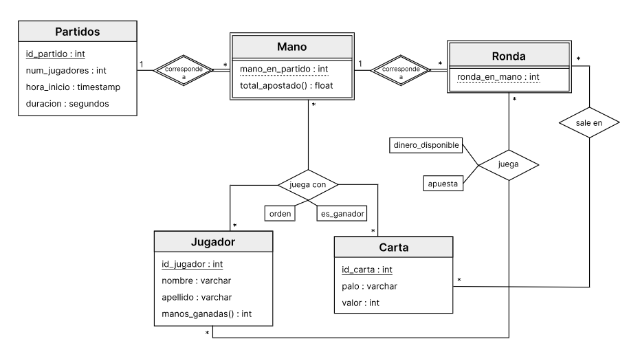
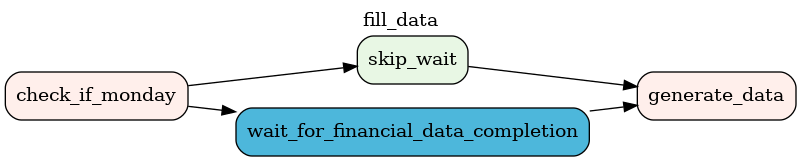
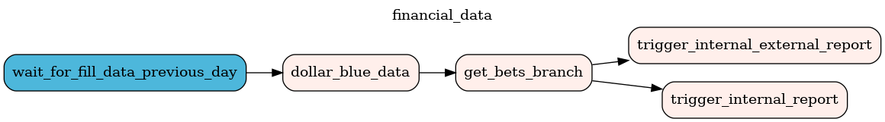
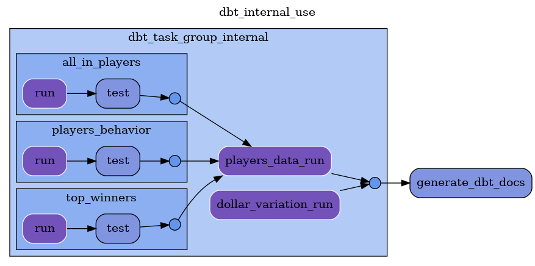
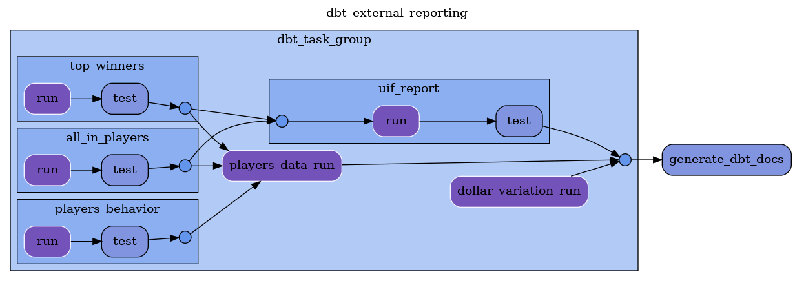

---
title: "Trabajo Práctico: entrega 2"
subtitle: "Tecnología Digital VII: Ingeniería de Datos"
author: [Gastón Loza Montaña, Valentín Bonás]
date: "12/07/24"
geometry: "left=2.5cm,right=2.5cm,top=2.5cm,bottom=2.5cm"
lang: "es"
...

En este trabajo, nuestra idea es ponernos en los zapatos de una empresa de una de las industrias más crecientes de los últimos tiempos: los casinos online.

### 1. Arquitectura

#### Origen y cadencia de los datos

1. Datos generados internamente:

    En este proyecto, generamos de forma sintética las partidas que se juegan en este casino, simulando así las partidas que se juegan cada día. Elegimos cargarlas diariamente para simular como el casino online carga todas las partidas al final del día, cuando la actividad baja.

    Utilizamos la librería Faker para realizar toda la generación de datos, incluyendo la generación de nuevos jugadores, las partidas y sus datos derivadas que se almacenan en las otras tablas (Rondas, Manos, JugadoresJueganCon, JugadoresEnRonda, CartasEnRonda, más info sobre modelo relacional en la Figura 1). Estos datos son generador como listas de records de un diccionario para que sean correctamente transformados a un DataFrame y luego ingestados en postgres. Para realizar esta carga tenemos un DAG designado llamado `fill_data`.

    

    Lo único que se carga inicialmente por fuera de este DAG, con el init de postgres, son las cartas dado que estas son siempres las mismas y no tiene sentido incluir en el DAG.

2. Datos externos:
   
   Datos del valor del dólar blue en Argentina de la última semana, obtenidos desde la API de Ambito.com. Estos datos se obtienen semanalmente en formato JSON para ser ingestados en la tabla `dollarblue`. Para realizar esta carga tenemos un DAG designado llamado `financial_data`.

#### Volumen esperado

- Jugadores: 10 por generación. Pues 
- Partidos: 50 por día. Pues consideramos que es un número razonable para nuestra flujo de partidas diarias.
    - Manos: 1 a 5 por partido.
    - Rondas: 1 a 10 por mano.
Datos del dólar blue: 5 registros por semana (se cuenta con información de los días hábiles).

#### Linaje de los datos

Una vez completada la ingesta de datos, se procede a utilizar nuestro DAG `financial_data` junto a los DAGs de dbt: `dbt_external_reporting` y `dbt_internal_use`.

El DAG `financial_data`, una vez completada la carga de datos del dólar blue de la semana,  hace un cálculo del total apostado en la semana dentro de un Branch Operator. Si ese cálculo supera un umbral (ficticio en este caso), es necesario realizar un aviso a la Unidad de Información Financier (UIF), por lo que se ejecutará el DAG `dbt_external_reporting`. En cambio si no se superó el umbral, se ejecutará dag DAG `dbt_internal_use` para uso interno.

Para el uso interno, se generarán 3 views que ejecutan distintas queries en SQL. La view `all_in_players` contiene a todos los jugadores que realizaron un all-in en la última semana. La segunda view, `players_behavior`, tiene información sobre el comportamiento de los jugadores para entender si apuestan más en la mano actual que lo que apostaron en la mano anterior.  La última view, `top_winners` tiene los 20 jugadores de la última semana que más dinero ganaron. Estas 3 views luego se unirán en una tabla llamada `players_data`.

Por otro lado, se calculará la variación del dólar en la semana y se guardará en una tabla llamada `dollar_variation`. Luego se utilizará está tabla en conjunto con la tabla de `players_data` servirán como datos de entrenamiento y testeo de un modelo de machine learning del comportamiento de los jugadores del casino online con respecto a los movimientos de la cotización de la moneda extranjera, para que la organización tome decisiones más eficientes sobre estrategias de marketing, entre otras.	

Si necesitamos hacer el reporte externo, se realizan las mismas acciones que para el uso interno, más un reporte a la UIF, que se almacena en la tabla `uif_reports` que junta la información de las views `all_in_players` y `top_winners` para informar al ente gubernamental sobre posibles casos de lavado de dinero y movimientos sospechosos de dinero.

#### Gobernanza del dato

La gobernanza de los datos en este tema es algo primordial. Entendemos que el acceso a qué jugadores juega cada partida y las cantidades de dinero que utilizan pueden ser información frágil. Es por esto que el acceso a esta información tiene que ser restringido y solo gente de altos rangos de la empresa deberían poder acceder, o gente que tenga el permiso para poder realizar los análisis de datos que mencionamos anteriormente. Además es importante que la UIF tenga acceso a los reportes que realizamos. 

### 2. Flujo de Datos: DAGs

##### `fill_data`

- Generación diaria: Genera y carga datos sintéticos diariamente.
- Tareas:
  - `check_day`: Verifica que el día sea lunes. En caso de serlo, debemos esperar a que se termine el run del DAG de financial_data de la semana pasada.
  - `wait_for_financial_data_completion`: espera hasta que el run de financial_data se haya terminado. Como este DAG sólo permite un run a la vez, no se correrán otros hasta que esta espera termine.
  - `skip_wait`: se ejecutará si el día del run no es lunes.
  - `generate_games`: Genera y carga datos de jugadores, partidos, manos, rondas, etc.

##### `financial_data`

- Obtención semanal: Obtiene y carga datos del dólar blue semanalmente.
- Tareas:
  - `wait_for_fill_data_previous_day`: Espera a que se complete la generación diaria de datos del día previo.
  - `dollar_blue_data`: Obtiene y carga los datos del dólar blue.
  - `get_bets_branch`: Determina el flujo de generación de informes basado en el total de apuestas de la semana.
  - `trigger_internal_external_report`: hace que se ejectute el DAG de dbt `dbt_external_reporting`.
  - `trigger_internal_report`: hace que se ejectute el DAG de dbt `dbt_internal_use`.

##### `dbt_internal_use`

- Generación semanal: Genera informes internos basados en los datos analizados para el modelo de machine learning.
- Tareas:
  - Genera las views y corre sus tests de los modelos `all_in_players`, `players_behavior` y `top_winners`.
  - Crea la tabla del modelo `players_data`.
  - Crea la tabla del modelo `dollar_variation`.
  - Genera la documentación e informes de DBT.

##### `dbt_external_reporting`

- Generación semanal: Genera informes internos al igual que `dbt_internal_use` y además genera el informe para la UIF.
- Tareas:
  - Genera las views y corre sus tests de los modelos `all_in_players`, `players_behavior` y `top_winners`.
  - Crea la tabla del modelo `players_data`.
  - Crea la tabla del modelo `dollar_variation`.
  - Crea la tabla del modelo `uif_reports`.
  - Genera la documentación e informes de DBT.

### 3. Flujo de Datos: DAGs

El enriquecimiento de los datos se dan en este caso como vimos para generar las tablas necesarias para el modelo de machine learning y el reporte externo ante la UIF.

Estos modelos los testeamos con los test out-of-box como `unique`, `not_null` y `accepted_values`. Por su parte, creamos un test personalizado para verificar que en la view `top_winners` el dinero ganado por los jugadores nunca puede ser menor o igual a 0.